# Map Server I: Introduction to GeoServer

> Fall 2017 | Geography 371 | Geovisualization: Web Mapping
>
> Instructor: Bo Zhao | Location: 235 Wilkinson | Time: MWF 1200 to 1250

**Learning Objectives**

- The major web map servers;
- The basic terminology of GeoServer;
- The Web Interface of GeoServer; and
- Publish a web map layer using a shapefile. 

## 1. Map Server Overview

A web mapping server is a specialized subset of web server. Like a web server, requests are sent to the server which are interpreted and responded. But the requests and responses are designed specifically toward the transfer of geographic information.

A web mapping server may use HTTP, but employ specialized protocols, such as **Web Map Service (WMS)**, **Web Feature Service (WFS)**. These protocols are designed for the transferring geographic information to and from the server, whether it be raw feature data, geographic attributes, or map images.

Some popular web mapping servers:

- [GeoServer](http://geoserver.org/)
- [MapServer](http://mapserver.org/)
- [Mapnik](http://mapnik.org/)
- [ArcGIS Server](http://www.esri.com/software/arcgis/arcgisserver/index.html)

> **Note:** Other web-based map services such as Google Maps have their own server technology and specialized protocols as well.

GeoServer is an open source software server written in Java that allows users to share and edit geospatial data. Designed for interoperability, it publishes data from any major spatial data source using open standards. Being a community-driven project, GeoServer is developed, tested, and supported by a diverse group of individuals and organizations from around the world.

**Data sources**

GeoServer can read from many different data sources, from files on the local disk to external databases. Through the medium of web protocols, GeoServer acts as an abstraction layer, allowing a standard method of serving geospatial data regardless of the source data type.

The following is a list of the most common data formats supported by GeoServer. This list is by no means exhaustive.

- Files
  - Shapefile
  - GeoTIFF
  - ArcGrid
  - JPEG2000
  - GDAL formats
  - MrSID
- Databases
  - PostGIS
  - ArcSDE
  - Oracle Spatial
  - DB2
  - SQL Server

>GeoServer implements standard open web protocols established by the [Open Geospatial Consortium (OGC)](http://www.opengeospatial.org/), a standards organization. GeoServer is the reference implementation of the OGC Web Feature Service (WFS) and Web Coverage Service (WCS) standards, and contains as well a high performance certified compliant Web Map Service (WMS). It is through these protocols that GeoServer can serve data and maps in an efficient and powerful way.

The next sections will give an overview of the two protocols most commonly used by GeoServer.

## 2. GeoServer Concepts

You’ll encounter lots of terminology when working with GeoServer, and some of it may be unfamiliar, especially if you are unaccustomed to web mapping. This section will introduce some of the most commonly-used terms used in GeoServer. All of these terms will be uses in the upcoming sections.

### 2.1. Workspace

A **workspace** (sometimes referred to as a namespace) is the name for a notional container for grouping similar data together. It is designed to be a separate, isolated space relating to a certain project. Using workspaces, it is possible to use layers with identical names without conflicts.

Workspaces are usually denoted by a prefix to a layer name or store name. For example, a layer called streets with a workspace prefix called nyc would be referred to by nyc:streets. This would not conflict with another layer called streets in another workspace called dc(dc:streets)

**Stores** and **layers** must all have an associated workspace. **Styles** may optionally be associated with a workspace, but can also be global.

> **Note:** Technically, the name of a workspace is a URI, not the short prefix. A URI is a Uniform Resource Identifier, which is similar to a URL, but does not need to resolve to a web site. The full workspace could have been [http://nyc](http://nyc) in which case the full layer name would be http://nyc:streets. GeoServer intelligently replaces the workspace prefix with the full workspace URI, but it can be useful to know the difference.

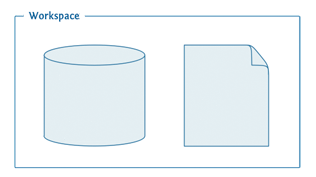

### 2.2 Store

A **store** is the name for a container of geographic data. A store refers to a specific data source, be it a shapefile, database, or any other data source that GeoServer supports.

A store can contain many `layers`, such as the case of a database that contains many tables. A store can also have a single layer, such as in the case of a shapefile or GeoTIFF. A store must contain at least one layer.

GeoServer saves the connection parameters to each store (the path to the shapefile, credentials to connect to the database). Each store must also be associated with one (and only one) `workspace`.

A store is sometimes referred to as a “datastore” in the context of vector data, or “coverage store” in the context of raster (coverage) data.

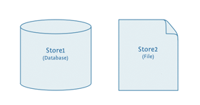

### 2.3 Layer

A **layer** (sometimes known as a featuretype) is a collection of geospatial features or a coverage. Typically a layer contains one type of data (points, lines, polygons, raster) and has a single identifiable subject (streets, houses, country boundaries, etc.). A layer corresponds to a table or view from a database, or an individual file.

GeoServer stores information associated with a layer, such as projection information, bounding box, and associated styles. Each layer must be associated with one (and only one) `workspace`.


### 2.4 Layer group

A **layer group**, as its name suggests, is a collection of layers. A layer group makes it possible to request multiple layers with a single WMS request. A layer group contains information about the layers that comprise the layer group, the order in which they are rendered, the projection, associated styles, and more. This information can be different from the defaults for each individual layer.

Layer groups do not respect the concept of `workspace`, and are relevant only to WMS requests.


The following graphic shows the various relationships between workspaces, stores, layers, and layer groups.

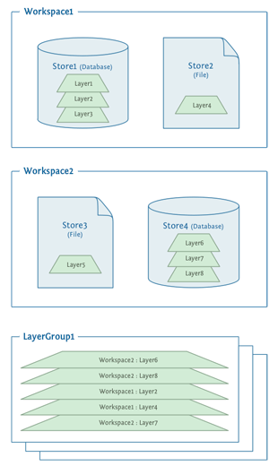

### 2.5 Style

A **style** is a visualization directive for rendering geographic data. A style can contain rules for color, shape, and size, along with logic for styling certain features or points in certain ways based on attributes or scale level.

Every layer must be associated with at least one style. GeoServer recognizes styles in Styled Layer Descriptor (SLD) format. The next lecture will go into `styling` in greater detail.

## 3. GeoServer Web Interface

GeoServer includes a web-based administration interface. Most GeoServer configuration can be done through this interface, without the need to edit configuration files by hand or use an API. In this section we will give a tour of the GeoServer Web Administration (or just "web admin") interface.

### 3.1 Viewing

The default location of the GeoServer web admin interface is http://localhost:8080/geoserver. The initial page is called the Welcome page.

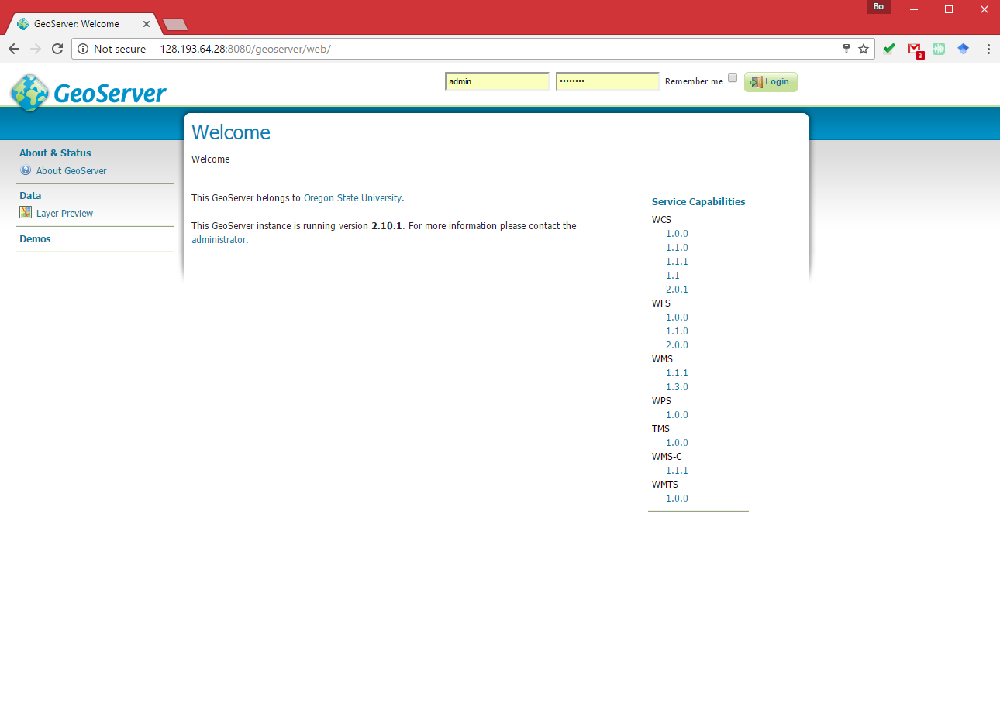

> **Note:** If your GeoServer is on a remote web location, please change localhost with the external IP of your remote server (such as your server on Google Cloud Platform. For example, you can access my server at http://128.193.64.28:8080/geoserver/)

To return to the Welcome page from anywhere, just click the GeoServer logo in the top left corner of the page.

### 3.2 Authentication

For security reasons, most GeoServer configuration tasks require you to be logged in first. By default, the GeoServer administration credentials are `admin` and `geoserver`, although this can and should be changed.

For security reasons, most GeoServer configuration tasks require you to be logged in first. By default, the GeoServer administration credentials are **`admin`** and **`geoserver`**, although this can and should be changed.

1\. Log in using the default credentials.


2\. After logging in, many more options will be displayed.

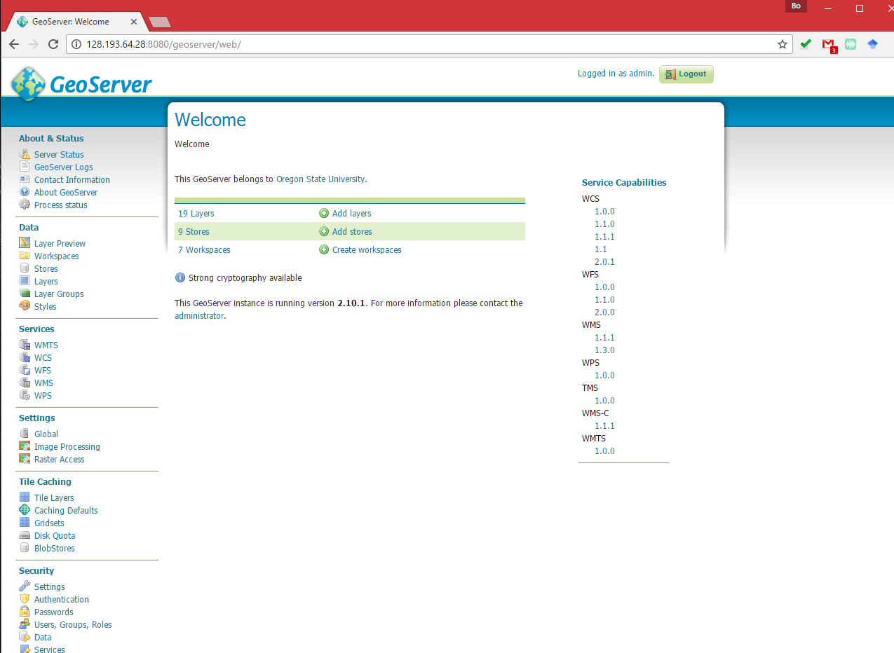

> **Note:** GeoServer has a powerful and robust security system. Access to resources such as layers and configuration can be granularly applied to users and groups as desired. Security is beyond the scope of this workshop, so we will just be using the built-in admin account.

### 3.3 Navigation

Use the links on the left side column to manage GeoServer, its services, data, security settings, and more. Also on the main page are direct links to the capabilities documents for each service (`WFS`, `WMS`, `WCS`). We will be using the links on the left under `Data`—among them `Layer Preview`, `Workspaces`, `Stores`, `Layers`, `Layer Groups`, and `Styles` — very often in this workshop, so it is good to familiarize yourself with their location.

### 3.4 Layer Preview

You can use the `Layer Preview` link to easily view layers currently being served by GeoServer. The Layer Preview pages includes quick links to viewing layers via OpenLayers along with other services.

1\. Click the `Layer Preview` link, located on the left side under `Data`.


2\. Preview a few layers by clicking the `OpenLayers` link next to each layer.


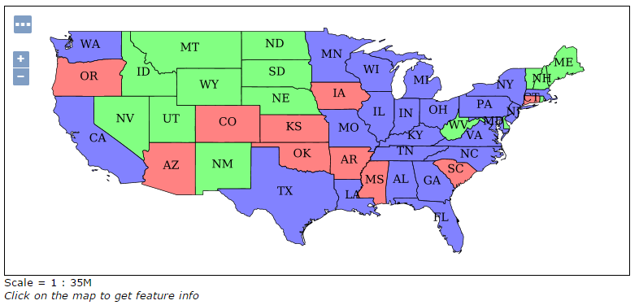

3\. Take a look at the contents of the URL bar when viewing an OpenLayers map. We will discuss this request and its parameters further in the `Web Map Service (WMS)` section.

### 3.5 Logs

GeoServer displays the contents of the application logs directly through the web interface. Reading the logs can be very helpful when troubleshooting. To view the logs, click on `GeoServer Logs` on the left under `About & Status`.

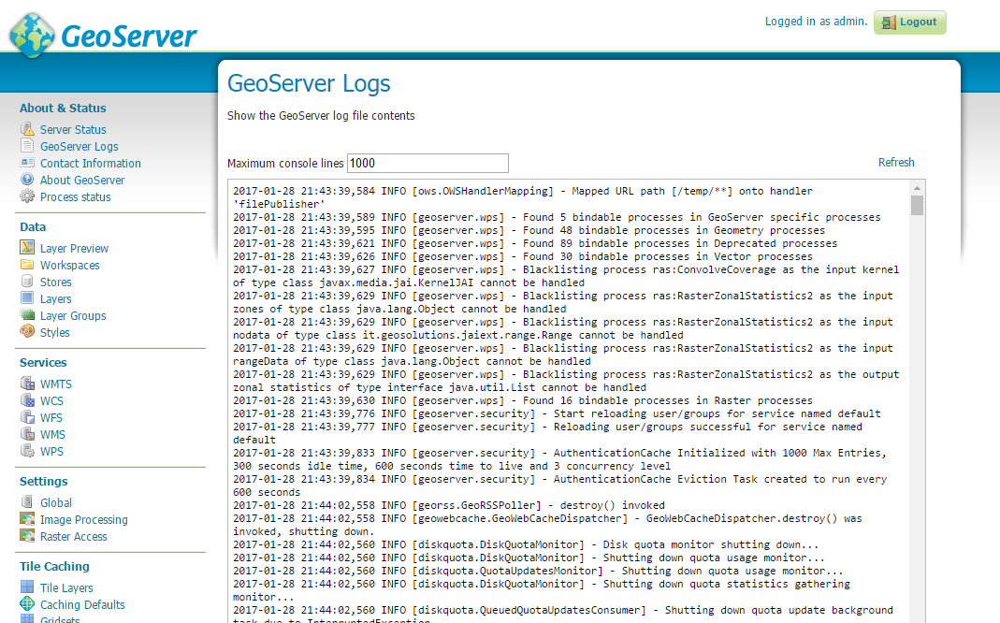


After walking through the above features, please spend some time exploring this interface and its features by clicking through the links on the left. The `Demos` link in particular contains some helpful utilities for learning about GeoServer functionality.

## 4. Working with Data

Loading and publishing data is the core of GeoServer. This section will detail how to set up a new project in GeoServer, as well as load data from multiple sources in different ways. After the data is loaded, a layer group will be created.

### 4.1 Adding a workspace

The first step in data loading is usually to create a `workspace`. This creates a virtual container for your project. Multiple layers from multiple sources can all be contained inside a workspace, with the primary constraint being that each layer name be unique.

1. Navigate to the main GeoServer web interface page.

2. Click on the `Workspaces` link on the left column, under `Data`.

   

3. Click on the “Add new workspace” link at the top center of the page.

   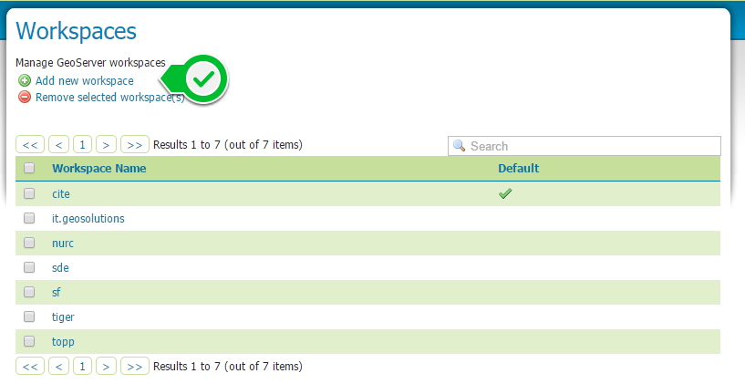

4. A workspace is comprised of a **Name** (also sometimes known as a “namespace prefix”), represented by a few characters, and a **Namespace URI**. These two fields must uniquely identify the workspace. Fill in the following information:

   | *Name*              | earth        |
   | ------------------- | ------------ |
   | *Namespace URI*     | http://earth |
   | *Default workspace* | *Checked*    |

   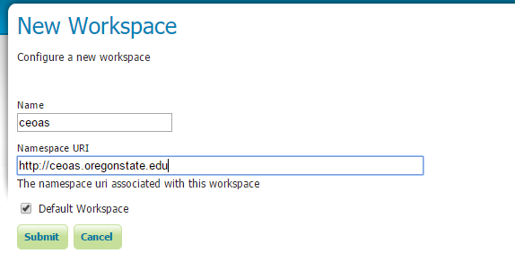

5. When done, click *Submit*.

   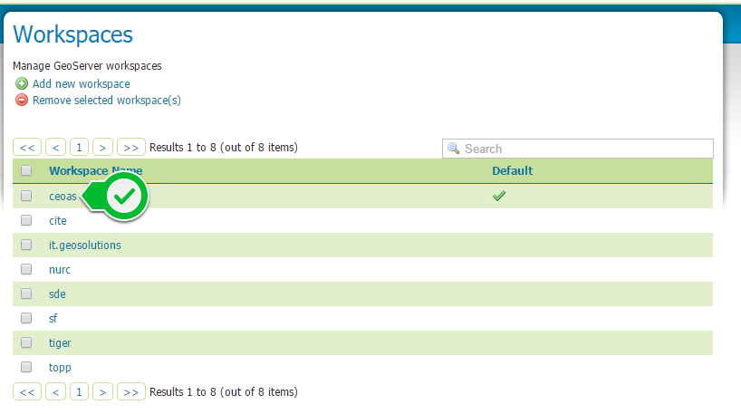

With our new workspace created and ready to be used, we can now start loading our data.

### 4.2 Publishing a Shapefile

Adding a single shapefile to GeoServer is one of the simplest data loading tasks. To start our discussion of data loading, we will load a shapefile showing all the county boundaries of Oregon.

#### 4.2.1 Adding a store

First, we need to load a shapefile store. In GeoServer terminology, a shapefile is a store that contains a single layer. We must add the store to GeoServer first before we can publish the layer that the store contains.

1\.From the *GeoServer web interface*page, click the *Stores* link on the left side, under *Data*.


2\. Click *Add new store*.

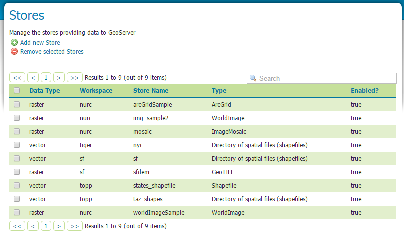

3\. Click `Shapefile` under `Vector Data Sources`.

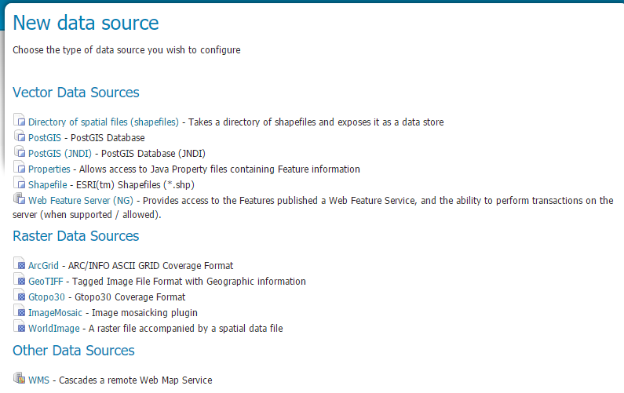

4\. A form will display. Fill out the form with the following information:

| Field              | Value                  | Notes                                    |
| ------------------ | ---------------------- | ---------------------------------------- |
| *Workspace*        | ceoas                  | Should be already the default            |
| *Data Source Name* | ore_counties           | Can be anything, but a good idea to match this with the name of the shapefile |
| *Enabled*          | *Checked*              | Ensures the layer is published. Unchecking will save configuration information only. |
| *Description*      | The counties of Oregon | Layer metadata is recommended but not required |

5\. In the box marked `Shapefile location *`, type in the full path to the shapefile if known, or click the `Browse...` button to navigate to the file. The file path may be something like:

```pwoewr
C:\Users\<username>\Desktop\geoserver_workshop\data\countries.shp
```

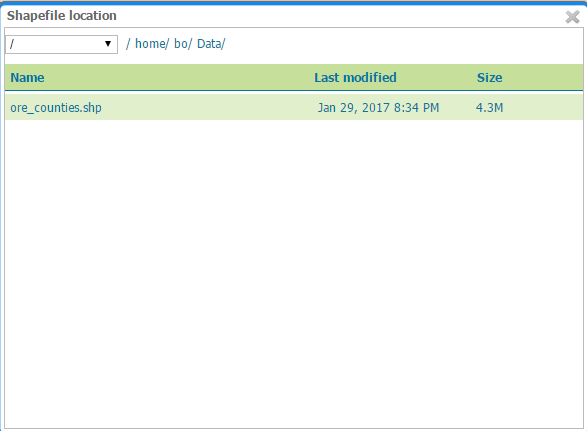

6\. Leave all other fields as their default values.

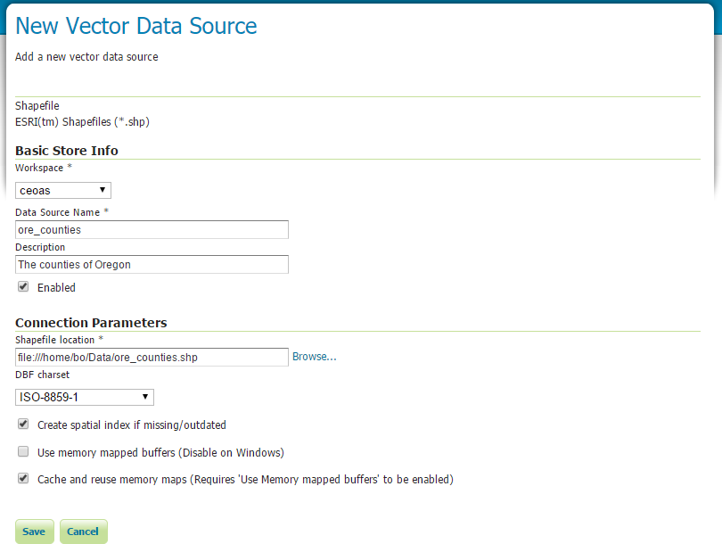

7\. When finished, click `Save`.

#### 4.2.2 Publishing a layer

We have loaded the shapefile store, but our layer has yet to be published. We’ll do that now.

1\. On the next screen, a list of layers in the store is displayed. Since we are working with a shapefile, there is only a single layer. Click the `Publish` link to configure the layer.


2\. This is the layer configuration page. There are many settings on this page, most of which we don’t need to work with now. We will return to some of these settings later. Fill out the form with the following info:

- In the **Coordinate Reference System** section, set the **Declared SRS** to EPSG:4326 and set the *SRS handling* to *Force declared*. This will ensure that the layer is known to be in latitude/longitude coordinates.
- In the **Bounding Boxes** section, click the *Compute from data* and *Compute from native bounds* links to set the bounding box of the layer.


Configuring a new layer (Part 1)

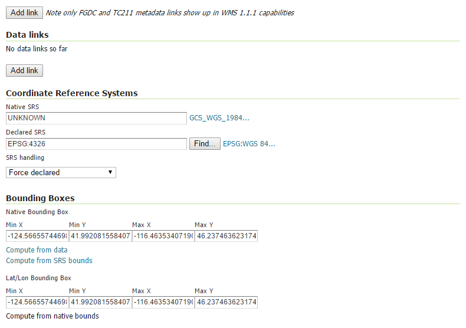

Configuring a new layer (Part 2)


Configuring a new layer (Part 3)

3\. When finished, click `Save`.

4\. Your shapefile is now published with GeoServer. You can now view the layer using the Layer Preview. Click the `Layer Preview` link.

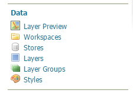

5\. A list of published layers is displayed. Find the layer in the list, and click the `Openlayer` link next to the select box.


>  **`Note:`**Lists in GeoServer are paged at 25 items at a time. If you can’t find the layer, you may need to click the *[2]* or *[>]* buttons. Alternately, type “earth” in the search box at the top to narrow the list.

6\. A new tab in your browser will open up, showing your layer inside an OpenLayers application. You can use your mouse to zoom and pan, and can also click the features in the window to display attribute information.

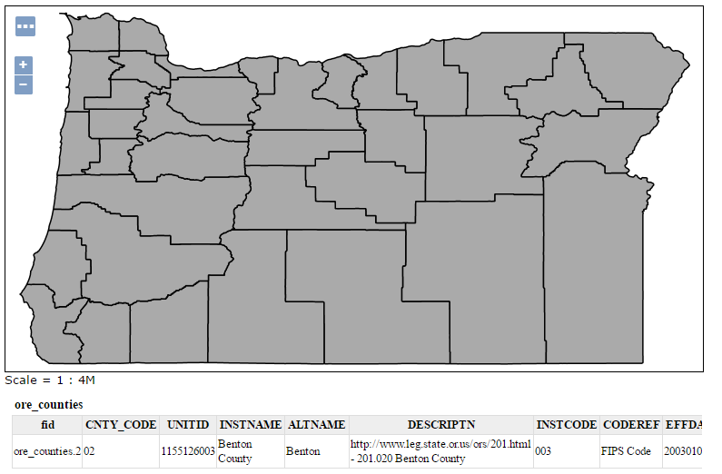

> **`Note:`** If you’re wondering where the style/color of the layer is coming from, this will be discussed in the upcoming Styling section.

The url to access this page is 

```powershell
http://128.193.64.28:8080/geoserver/ceoas/wms?service=WMS&version=1.1.0&request=GetMap&layers=ceoas:ore_counties&styles=&bbox=-124.56655744698392,41.99208155840781,-116.46353407190144,46.23746362317423&width=768&height=402&srs=EPSG:4326&format=application/openlayers
```

## 5. After-class Practices

GeoServer can also publish **raster** imagery. This could be simple georeferenced images (such as Blue Marble imagery), multi-band DEM (digital elevation model) data, or many other options. If you are interested in creating a raster imagery layer, please follow the guideline ["create raster imagry layer"](http://geoserver.geo-solutions.it/edu/en/pretty_maps/styling_raster.html)  or another one ["create a geotiff layer"](http://wiki.ieee-earth.org/index.php?title=Documents/GEOSS_Tutorials/GEOSS_Provider_Tutorials/Web_Coverage_Service_Tutorial_for_GEOSS_Providers/Section_4_:_Provisioning%2F%2FUsing_the_service_or_application/Section_4.3_:_Detailed_steps_of_the_Use_Cases/4.3.1_Offering_a_GeoTiff_dataset_with_Geoserver to create a raster layer).

Also , Geoserver allows you combine several layers as a layer group. This is useful when creating a **base map**, or other situations when more than one separate layer needs to be requested simultaneously or frequently. Since layers typically contain only a single type of geometry, using a layer group also allows you to combine data types in one single WMS request. If you are interested in creating a layer group, please follow the instruction  ["create Layer Groups"](http://docs.geoserver.org/latest/en/user/data/webadmin/layergroups.html)


Even though the Layer Importer generated unique styles for each layer, this layer group doesn’t look very nice. The following section will discuss the next important step of making maps: **styling**.

## References

[1] OSGEO (2016) GeoServer: Introduction, retrieved Decemeber 28, 2016 from http://docs.geoserver.org/latest/en/user/introduction/index.html#introduction

[2] http://workshops.boundlessgeo.com/geoserver-intro/data/index.html