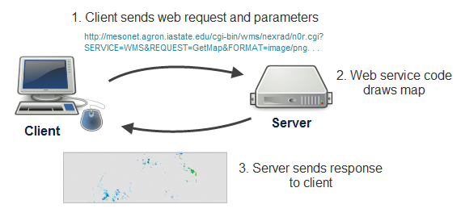
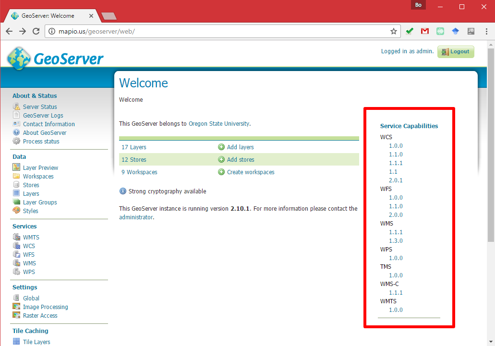
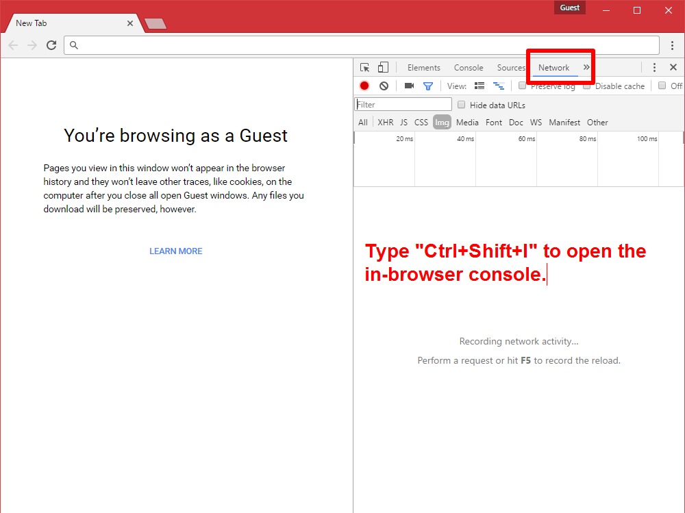
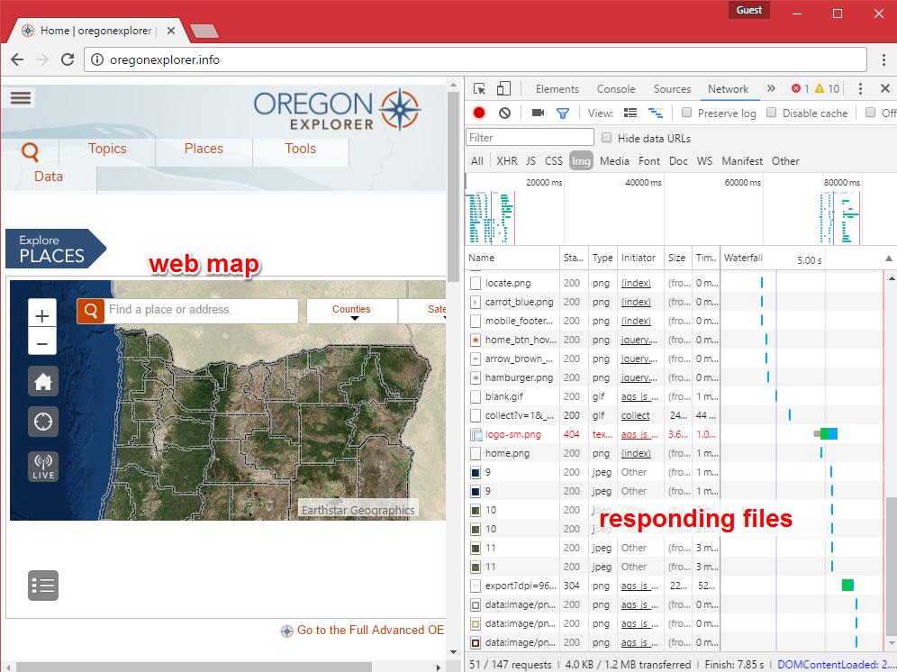
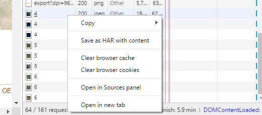
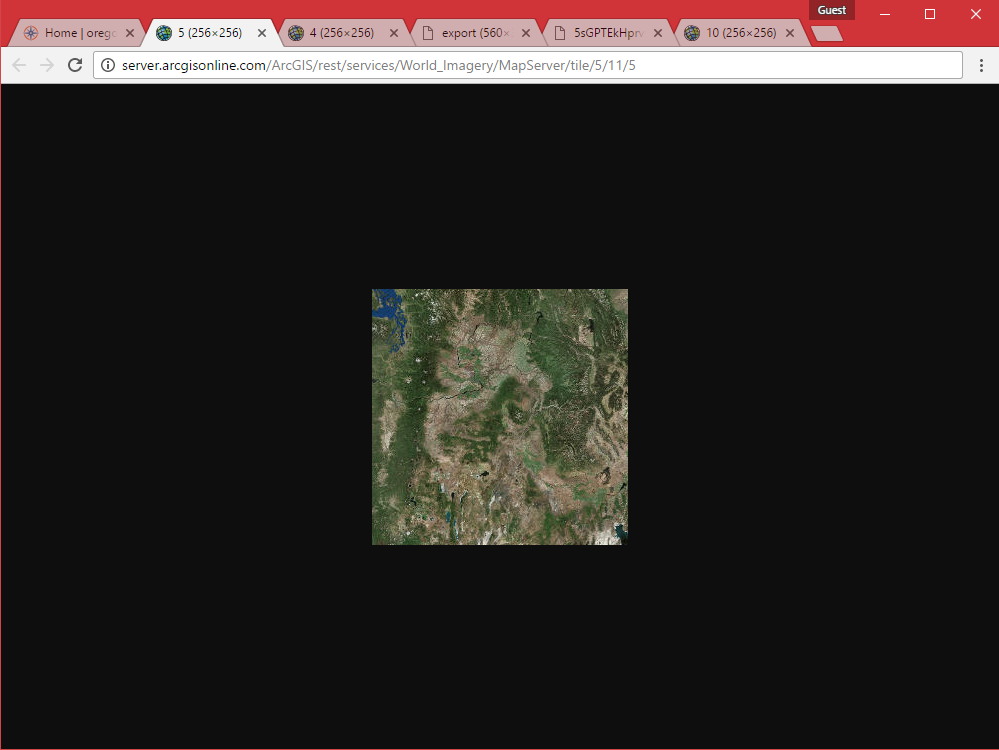
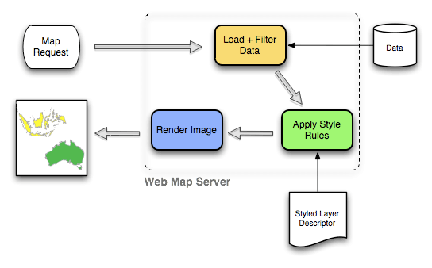
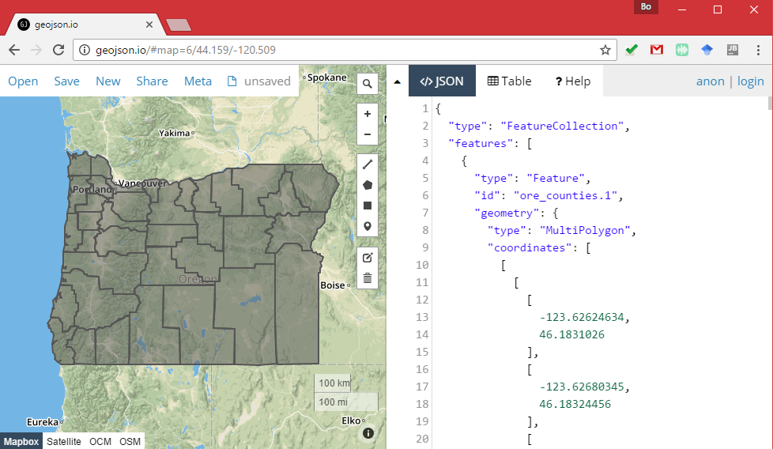

# Map Server III: Web Map Services

> Fall 2017 | Geography 371 | Geovisualization: Web Mapping
>
> Instructor: Bo Zhao | Location: 235 Wilkinson | Time: Wednesday 1200 to 1250

**Learning Objectives**

- Get to know the basic syntax of WMS and WFS;
- Understand the work flow of wms request;
- Walk through the web map services provided by GeoServer; and
- Able to read and edit a wms and wfs request.

## 1. Recap web services

If you search the Internet, you'll find many definitions of web services and can easily get yourself confused. For the purposes of this course, just think of a web service as **a focused task that a specialized computer (the server) knows how to do and allows other computers to invoke**. You work with the web service like this:

1. You invoke the web service by making a request from the client. To make this request, you use HTTP, a standard protocol that web browsers use for communicating between clients and servers. The request contains structured pieces of information called parameters. These give specific instructions about how the task should be executed.
2. The server reads the request and runs its web service code, considering all the parameters while doing so. This produces a response, which is usually a string of information or an image.
3. The server sends you the response, and your application uses it.

Examine how the following simple diagram describes this process, returning a map of current precipitation:



Now, for an example. Let's suppose that you've identified the URL of a web service out there somewhere that draws maps. You make a request by constructing a URL (http://...) containing the address of the web service and various parameters for the map, such as the format of the image you want to receive (JPG, PNG, etc.), bounding box (coordinates defining the geographic area you want to see mapped), and map scale. You paste this into your browser's address bar and the server sends you a response containing the map image you requested.

Here's an example of just such a request, using a radar map of the United States. First, see if you can identify some of the parameters in the URL. Then take a guess at what the response will look like when you get it back. Then click the link to invoke the web service and get the response:

```http
http://mesonet.agron.iastate.edu/cgi-bin/wms/nexrad/n0r.cgi?SERVICE=WMS&REQUEST=GetMap&FORMAT=image/png&TRANSPARENT=TRUE&STYLES=&VERSION=1.3.0&LAYERS=nexrad-n0r&WIDTH=877&HEIGHT=276&CRS=EPSG:900913&BBOX=-15252263.28954773,2902486.4758432545,-6671748.242369267,5602853.811101243
```

As you examined the URL of this request, you might have noticed parameters indicating the width and height of the image, the image format, the image background transparency, and the bounding coordinates of the map to be drawn. These parameters provide specific details about how the web service should run its map drawing code. You see these parameters reflected in the response image sent back to your browser when you clicked the link. In a future lesson, you'll learn about more of the parameters in the request above.

> **Note:** Change some of the parameters of the URL, and see how the differences of the responding image tiles. For example, change the value of FORMAT to image/jpeg, the Size of the WIDTH and HEIGHT, change the value of CRS to EPSG:3857 or EPSG:4326. 

Not all web requests invoke web service code. Some web requests just return you a file. This is how tiled maps work, and this is why they are so fast. You'll learn more about tiled maps in a later lesson, but examine the following request for a specific zoom level, row, and column of a tile:

```http
http://a.tile.openstreetmap.org/15/11068/19742.png
```

The request drills down into the server's folder structure and returns you the requested PNG image as a response. No special code ran on the server other than the basic file retrieval, therefore you could argue that a web service was not invoked. However, this type of simple web request is also an important part of many web maps.

Not all web services use the same format of URL and parameters. In this course, you'll learn about some of the most common formats for online web services, especially ones that have been openly developed and documented to work across software packages. So, this lecture, we will talk about WMS (Web Map Service) and WFS (Web Feature Service). Next week, we will talk about Map tiles.

Open an GeoServer instance, and find the web map services  this GeoServer provides:



## 2. View web service requests and responses

Here's a simple way you can view web requests made “behind the scenes” by your browser as you navigate a website. These instructions use the in-browser console for Google Chrome. 

1\. Open Google Chrome, and type `ctrl+shift+I` to open the in-browser console, and turn to the `Network` tab. 



2\. Open the Oregon Explore at http://oregonexplorer.info/. In the left panel, you will see the web page. This web page contains a web map. In the right panel, you will see all the files that are being loaded to your client.



3\. Navigate the map of the Oregon. Notice the web requests as they are sent. You'll see a lot of requests appearing for map tiles.

4\. Hover over a request to see its full URL and a thumbnail of the response image, if any.

5\. right-click on a request, and choose "Open in new tab".



6\. you will see a image open up in a new tab.



This kind of developer tool will be valuable to you later in the course as you develop your own web maps, mainly for troubleshooting scenarios where you expect a map to show up and your browser does not send you the expected response.

## 3. Web Map Service (WMS)

A fundamental component of the web map (and probably the simplest to understand) is the map image. **The Web Map Service (WMS)** is a standard protocol for serving georeferenced map images generated by a map server. In short, WMS is a way for a client to request map tiles from a server. The client sends a request to a map server, then the map server generates an image based on parameters passed to the server in the request and finally returns an image.

It is important to note that the source material from which the image is generated need not be an image. The WMS generates an image from whatever source material is requested, which could be vector data, raster data, or a combination of the two.



> A work flow of the WMS map request

### 3.1 Sample WMS request

The following is a sample WMS request to a hosted GeoServer instance at [http://geoserver.mapio.us](http://geoserver.mapio.us):

```http
http://mapio.us/geoserver/ceoas/wms?SERVICE=WMS&VERSION=1.1.1&REQUEST=GetMap&FORMAT=image/png&TRANSPARENT=true&STYLES&LAYERS=ceoas:ore_counties&SRS=EPSG:4326&WIDTH=768&HEIGHT=402&BBOX=-124.73876953125,41.90185546875,-116.30126953125,46.318359375
```

Here is the same request with line breaks added for clarity:

```http
http://mapio.us/geoserver/ceoas/wms?
    SERVICE=WMS&
    VERSION=1.1.1&
    REQUEST=GetMap&
    FORMAT=image/png&
    TRANSPARENT=true&
    STYLES&
    LAYERS=ceoas:ore_counties&
    SRS=EPSG:4326&
    WIDTH=768&
    HEIGHT=402&
    BBOX=-124.73876953125,41.90185546875,-116.30126953125,46.318359375
```

While the full details of the WMS protocol are beyond the scope of this course, a quick scan of this request shows that the following information is being requested:

> - Server details (a WMS 1.1.1 request)
> - Request type (WMS GetMap)
> - Layer name (ceoas:ore_counties)
> - Projection (EPSG:4326)
> - Bounding box (in this case, latitude/longitude coordinates)
> - Image properties (768x402 PNG)

If you paste the full request into a browser, the result would be:


> An image generated by a WMS request

### 3.2 Other WMS requests

A WMS request can ask for more than just a map image (the “GetMap” operation). An example of another such request is a request for information about the WMS server itself. The request is called **GetCapabilities**, and the response is known as the **capabilities document**. The capabilities document is an XML response that details the supported image formats, projections, and map layers being served by that WMS.

The following is a WMS GetCapabilities request given to the same WMS used above

```http
http://mapio.us/geoserver/wms?service=WMS&version=1.3.0&request=GetCapabilities
```

And the same request with line breaks for clarity:

```http
http://mapio.us/geoserver/wms?
    service=WMS&
    version=1.3.0&
    request=GetCapabilities
```

You can paste this request into a browser to see the result.

> **Note:** For more information, please see the [GeoServer documentation on WMS](http://docs.geoserver.org/latest/en/user/services/wms/) or the [OGC page on the Web Map Service protocol](http://www.opengeospatial.org/standards/wms).

## 4. Web Feature Service (WFS)

A web mapping server can also (when allowed) return the actual geographic data that comprise the map images. One can think of the geographic data as the “source code” of the map. This allows users to create their own maps and applications from the data, convert data between certain formats, and be able to do raw geographic analysis of data. The protocol used to return geographic feature data is called **Web Feature Service (WFS)**.

### 4.1 Sample WFS request

The following is a sample WFS request to a GeoServer instance at [http://geoserver.mapio.us](http://geoserver.mapio.us), 

```http
http://mapio.us/geoserver/ceoas/ows?service=WFS&version=1.0.0&request=GetFeature&typeName=ceoas:ore_counties&outputFormat=application/json
```

The following is the same request with line breaks added for clarity:

```http
http://mapio.us/geoserver/ceoas/ows?
    service=WFS&
    version=1.0.0&
    request=GetFeature&
    typeName=ceoas:ore_counties&
    outputFormat=application/json
```

While the details of the WFS protocol are beyond the scope of this course, a quick scan of this request shows that the following information is being requested:

> - Server details (WFS 1.0.0 request)
> - Request type (GetFeature)
> - Layer name (ceoas:ore_counties)
> - output Format (geojson)

The responding geojson contains the coordinates for each feature, along with the attributes associated with this feature. Scroll down to the bottom to see the feature attributes. Please save the response as a geojson file and open the file in http://geojson.io](http://geojson.io). Other than geojson, GeoServer offers other output formats as well, such as XML, JSON, CSV, and even a shapefile archive.



### 4.2 Other WFS requests

A WFS request can ask for much more than just feature data. An example of another such request is to request information about the WFS server. The request is called **GetCapabilities**, and the response is known as the **capabilities document**. The capabilities document is an XML response that details the supported data layers, projections, bounding boxes, and functions available on the server.

**A WFS capabilities document is not the same as a WMS capabilities document. One displays information about image formats, the other about feature data.**

The following is a sample WFS GetCapabilities request:

```http
http://mapio.us/geoserver/wfs?service=WFS&version=1.1.0&request=GetCapabilities
```

And the same request, with line breaks added for clarity:

```http
http://mapio.us/geoserver/wfs?
  service=WFS&
  version=1.1.0&
  request=GetCapabilities
```

You can paste this request into a browser to see the result.

For more information, please see the [GeoServer documentation on WFS](http://docs.geoserver.org/latest/en/user/services/wfs/) or the [OGC page on the Web Feature Service protocol](http://www.opengeospatial.org/standards/wfs).

## References

[1] Plewe, B. (1997). GIS online: Information retrieval, mapping, and the Internet. OnWord Press.
[2] Boundless (201X). GeoServer Server. retrieved on January 10, 2017 from http://workshops.boundlessgeo.com/geoserver-intro/overview/server.html