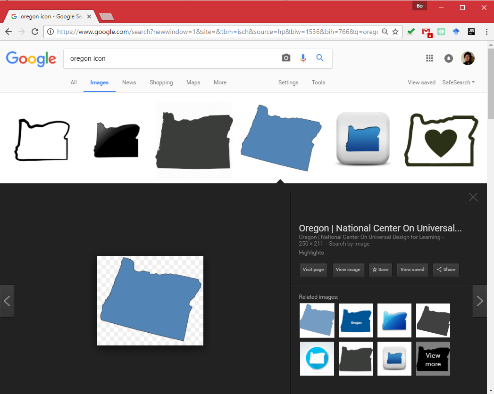
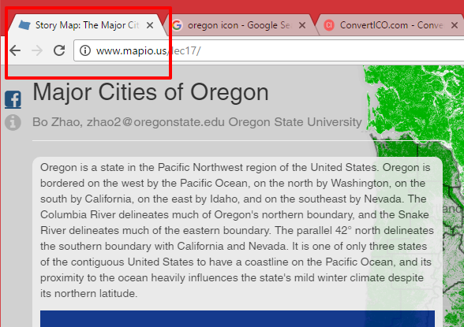
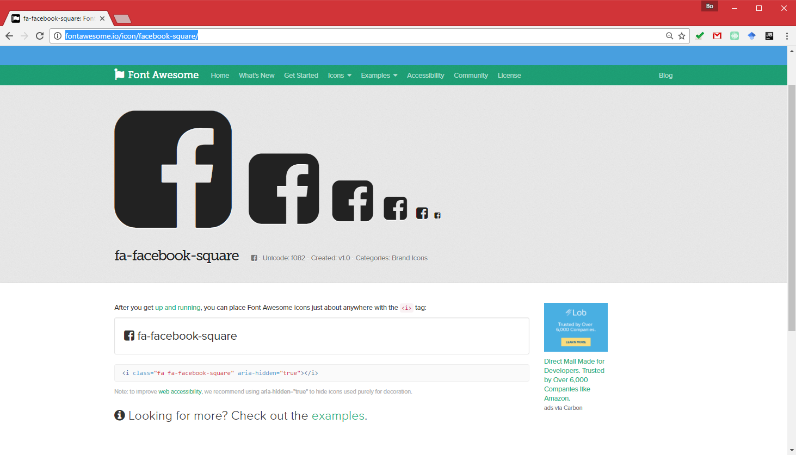
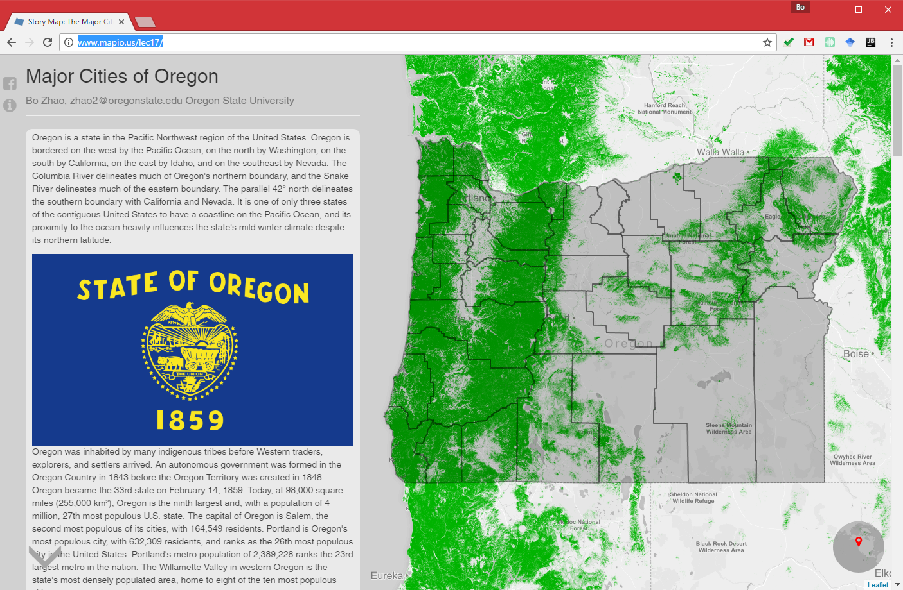

# Map Design II: Bootstrap and Others

> Fall 2017 | Geography 371 | Geovisualization: Web Mapping
>
> Instructor: Bo Zhao | Location: Wilkinson 235 | Time: MWF 1200 to 1250

**Learning Objectives**

Add a series of web elements, including
- favicon,
- text font,
- control object,
- social media component, and
- an about page.

In this lecture, we will continue to work on the story map, but enrich the map with a lot of web features. Most of the features we will discuss today are based on Bootstrap.

## 1. Add a favicon

A favicon (short for favorite icon), also known as a shortcut icon, website icon, tab icon, URL icon, or bookmark icon, is a file containing one or more small icons,associated with a particular website or web page. A web designer can create such an icon and upload it to a website (or web page) by several means, and graphical web browsers will then make use of it. Browsers that provide favicon support typically display a page's favicon in the browser's address bar (sometimes in the history as well) and next to the page's name in a list of bookmarks. Browsers that support a tabbed document interface typically show a page's favicon next to the page's title on the tab, and site-specific browsers use the favicon as a desktop icon.

To add a favicon, you need to creat one using an image editor, such as illustrator or photoshop. Or, you can find an open source one from google image search. Regarding the images found from the Internet, please refer to or credit the author's efforts in your web map application.

For example, I search "oregon icon" on [Google Images](https://images.google.com/)



I find an png image, and then convert the image to ico from http://convertico.com/.


I downloaded the converted file, named it as **favicon.ico**, and then put it in the `img` folder.

To properly show the favicon, I added one line in the `head` tag of the `index.html` file.

```html
<!--add favicon for the web page-->
<link rel="shortcut icon" href="img/favicon.ico" type="image/x-icon">
```

Regarding the code, I declare that I added the favicon for the web page, and include from the right place. If everything works correctly, you will see an icon showing on the web page tab on your Google Chrome browser.



## 2. Change the Font

Choosing fonts is an important part of cartography, and an often overlooked one. Right now, our map uses the default Browser font, usually Times New Roman. To edit fonts, we want to style CSS. In CSS, there are a lot of options for fonts, for more reading, check out the [w3schools font documentation](http://www.w3schools.com/css/css_font.asp).

Traditionally, a font is loaded into your page only if you have it on your computer. This presents a problem though, if someone doesn't have the font, it will change the page to use secondary or default fonts. In order to ensure that every visitors computer display the same, you can link to online font libraries. A common, useful online font library is Google Fonts. Google fonts can be added to any site, and since you link to the style, you don't have to worry about the user not having the font installed on their computer. Check out the Google Font library and explore their options. Let's link a common web font called Open Sans to our document so we can use it. To link it to our document, enter the following line of code into the head section of your document. It should go right after your stylesheets.

```html
<!--use a better font for this web map-->
<link href='http://fonts.googleapis.com/css?family=Helvetica' rel='stylesheet' type='text/css'>
```

Next, to style all text in our document with the Open Sans font, modify the body tag in the CSS (the code between the style tags). Modify the body CSS properties to look like the following, adding a font-family property after margin.

```css
body {
    font-family: Helvetica, 'Open Sans', sans-serif;
}
```

Save and refresh your map. Open Sans will now be your preferred font!

## 3. Control Object - Scrolling Down Arrow

Inspired by the web map entitled ["California,s Getting Fracked"](http://www.facesoffracking.org/data-visualization/),  we found that a scrolling down arrow will help the audience reading the web map. Thinking about the working logics of the scrolling-down arrow, it should be an clickable arrow icon on one corner of the web map application. If hovering on the arrow, the color of arrow will be changed, and if clicking the arrow, the text panel should be scrolled down.

Bootstrap provides a set of icons for web design usage. Regarding the scrolling-down function, we look for an arrow icon at [http://bootsnipp.com/buttons](http://bootsnipp.com/buttons), and finally identify one - `glyphicon-chevron-down`. Since the icon controls the texts, we prefer to put it under the text panel and as the very last element.

```html
<div class="col-sm-6 col-md-4 main">
<section />
<section />
<section />
...
 <!--add an arrow for scrolling down the texts-->
 <div class="glyphicon glyphicon-menu-down glyphicon-align-center arrow-down"></div>
</div>
```

In order to put it on the right place and display properly, we define its style in `css\style-new.css`.

```css
.arrow-down {
    position:fixed;
    top:90%;
    cursor: pointer;
    z-index:1002;
    font-size: 60px;
    color: #a5a5a5;
}

.arrow-down:hover {
    color: #0e0e0e;

}
```

Also, to make it clickable, we add an click event in the `storymap.js` javascript between **line 124 to 128**. We select the scrolling down arrow element via its className, and add a function to make sure that it will scroll in a length that equals to one third of the total height of the window.

```js
 var downBtn = element.find('.arrow-down');

             downBtn.click(function () {
                 window.scrollBy(0, $(window).height() / 3);
             });
```

Till now, a control object is properly added. You can test it by clicking on the arrow.


## 4. Add a Social Media Component

A social media button will help you spread a web map to more audience. This lecture only walk you through how to share the web map to Facebook, the ways to share to other social media applications are supposed to be quite similar. 

Before adding the link for sharing web map on Facebook, please read the tutorial on.

[https://developers.facebook.com/docs/plugins/share-button](https://developers.facebook.com/docs/plugins/share-button).

To find a Facebook icon, we will use [Font Awesome](http://fontawesome.io), which is a font library dedicated for web design use. We will include the library within the `head` tag.

```html
<!--facebook and info icons-->
<link rel="stylesheet" href="https://cdnjs.cloudflare.com/ajax/libs/font-awesome/4.7.0/css/font-awesome.min.css">

```

At [http://fontawesome.io/icons/](http://fontawesome.io/icons/), we search the term `facebook` in the search box.


Then, we can find the classname of the Facebook icon at [http://fontawesome.io/icon/facebook-square/](http://fontawesome.io/icon/facebook-square/).



As shown, the class for the facebook icon is **"fa fa-facebook-square"**. So, we add a link as below:

```html
<!--facebook icon-->
<a class="fa fa-facebook-square social" href="https://facebook.com/sharer.php?u=http://www.mapio.us/lec17" target="_blank"></a>
```
This tag indicates that if we click on it, a new web page will be created, this web page directs to `https://facebook.com/sharer.php?u=http://www.mapio.us/lec17`. Basically, the url `http://www.mapio.us/lec17` indicates where this web map application is deployed.

This share function also needs several parameters, which are defined in the head tag.

```html
<!--meta data for sharing links on Facebook-->
<meta property="og:title" content="The major cities in Oregon" />
<meta property="og:url" content="www.mapio.us/lec17" />
<meta property="og:description" content="This is an example of map story." />
<meta property="og:image" content="img/social.png" />
```
`og:title` indicates the title of the shared page, `og:url` is the url of the web map, `og:decription` is a paragraph of description, and `og:image` is the path to the screenshot of the web map. This image is stored in the server.

In order to put it on the right place and display properly, we define its style in `css\style-new.css`.

```css
.social {
    position:fixed;
    cursor: pointer;
    font-size:24px;
    color:darkgray;
    z-index:1003;
    top: 4%;
    left:5px;
}
.social:hover {
    color: darkblue;
    text-decoration: none;
}
```

If everything is properly configured, you will see a button on the top left of the interface.


Once you click on the facebook button, you will creat a new tab as showing below.


## 5. Add an About Page

Similar to the Facebook button, we create another button under the Facebook button. This button can invoke the about page.  This button shows an info-circle icon and lies right under the facebook button.

```html
<!--info icon-->
<i class="fa fa-info-circle social" style="top:8%" data-toggle="modal" data-target="#info-modal"></i>
```

And then, we add a dialog. If the button is clicked, this dialog will be popped up.

```html
<!--the info page-->
<div class="modal fade" id="info-modal" role="dialog">
    <div class="modal-dialog modal-lg">
        <div class="modal-content">
            <div class="modal-header">
                <button type="button" class="close" data-dismiss="modal">&times;</button>
                <h4 class="modal-title">About</h4>
            </div>
            <div class="modal-body">
                <p>...</p>
            </div>
            <div class="modal-footer">
                <button type="button" class="btn btn-default" data-dismiss="modal">Close</button>
            </div>
        </div>
    </div>
</div>
```

**The "Trigger" part:**

To trigger the modal window, you need to use a button or a link.

Then include the two data-* attributes:

- `data-toggle="modal"` opens the modal window
- `data-target="#info-modal"` points to the id of the modal

**The "Modal" part:**

The parent `<div>` of the modal must have an ID that is the same as the value of the data-target attribute used to trigger the modal ("myModal").

The `.modal` class identifies the content of `<div>` as a modal and brings focus to it.

The `.fade` class adds a transition effect which fades the modal in and out. Remove this class if you do not want this effect.

The attribute `role="dialog"` improves accessibility for people using screen readers.

The `.modal-dialog` class sets the proper width and margin of the modal.

**The "Modal content" part:**

The `<div>` with `class="modal-content`" styles the modal (border, background-color, etc.). Inside this `<div>`, add the modal's header, body, and footer.

The `.modal-header` class is used to define the style for the header of the modal. The `<button>` inside the header has a `data-dismiss="modal"` attribute which closes the modal if you click on it. The `.close` class styles the close button, and the `.modal-title`class styles the header with a proper line-height.

The `.modal-body` class is used to define the style for the body of the modal. Add any HTML markup here; paragraphs, images, videos, etc.

The `.modal-footer` class is used to define the style for the footer of the modal. Note that this area is right aligned by default.

## Concluding remark



To browse this application, you can visit [http://www.mapio.us/lec17/](http://www.mapio.us/lec17/). The code has been already uploaded to [canvas.oregonstate.edu](canvas.oregonstate.edu). I recommend you practice these web design techniques after class.

## References:

[1] https://en.wikipedia.org/wiki/Favicon


