# 3D Web Mapping I: Basics

> Fall 2017 | Geography 371 | Geovisualization: Web Mapping
>
> Instructor: Bo Zhao | Location: 235 Wilkinson | Time: MWF 1200 to 1250

**Learning Objectives**

- Get to know the basics of 3D visualization on web, including the history, browsers, libraries and applications; 
- The functionality of Three.js; and
- Create an virtual globe with three.js.

## 1. WebGL

WebGL (Web Graphics Library) is a JavaScript API for rendering 3D graphics within any compatible web browser without the use of plug-ins. WebGL is integrated completely into all the web standards of the browser allowing GPU accelerated usage of physics and image processing and effects as part of the web page canvas. WebGL elements can be mixed with other HTML elements and composited with other parts of the page or page background. WebGL programs consist of control code written in JavaScript and shader code that is written in GLSL, a language similar to C/C++, and is executed on a computer's Graphics Processing Unit (GPU). WebGL is designed and maintained by the non-profit Khronos Group.


### 1.1 History

WebGL evolved out of the Canvas 3D experiments started by Vladimir Vukićević at Mozilla. Vukićević first demonstrated a Canvas 3D prototype in 2006. By the end of 2007, both `Mozilla` and `Opera` had made their own separate implementations.

In early 2009, the non-profit technology consortium Khronos Group started the WebGL Working Group, with initial participation from Apple, Google, Mozilla, Opera, and others. Version 1.0 of the WebGL specification was released March 2011. As of March 2012, the chair of the working group is Ken Russell.

Early applications of WebGL include Zygote Body. In November 2012 Autodesk announced that they ported most of their applications to the cloud running on local WebGL clients. These applications included Fusion 360 and AutoCAD 360.

Development of the WebGL 2 specification started in 2013. This specification is based on OpenGL ES 3.0.

### 1.2 Support

WebGL is widely supported in modern browsers. However its availability is dependent on other factors like the GPU supporting it. The official WebGL website offers [a simple test page](https://get.webgl.org/).

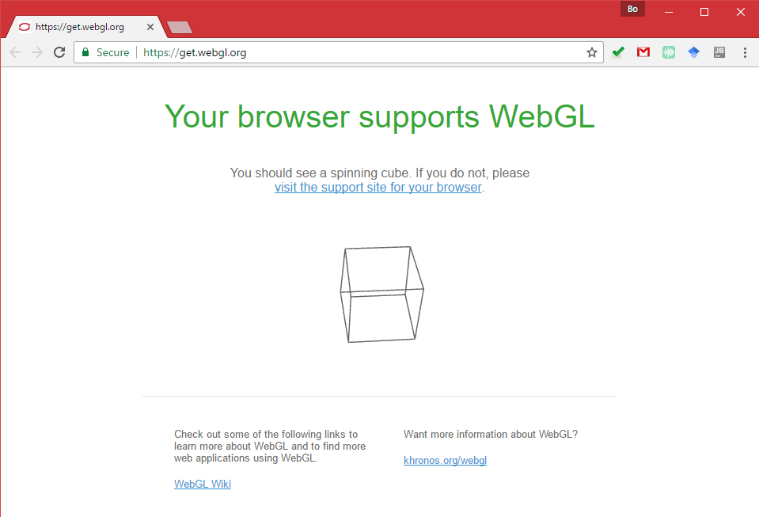

- Google Chrome – WebGL has been enabled on all platforms that have a capable graphics card with updated drivers since version 9, released in February 2011. By default on Windows, Chrome uses the ANGLE (Almost Native Graphics Layer Engine) renderer to translate OpenGL ES to Direct X 9.0c or 11.0, which have better driver support. On Linux and Mac OS X the default renderer is OpenGL however. It is also possible to force OpenGL as the renderer on Windows. Since September 2013, Chrome also has a newer Direct3D 11 renderer, which however requires a newer graphics card.
- Mozilla Firefox – WebGL has been enabled on all platforms that have a capable graphics card with updated drivers since version 4.0. Since 2013 Firefox also uses DirectX on the Windows platform via ANGLE.
- Safari – Safari 6.0 and newer versions installed on OS X Mountain Lion, Mac OS X Lion and Safari 5.1 on Mac OS X Snow Leopard implemented support for WebGL, which was disabled by default before Safari 8.0.
- Opera – WebGL has been implemented in Opera 11 and 12, although was disabled by default in 2014.
- Internet Explorer – WebGL is partially supported in Internet Explorer 11. It initially failed the majority of official WebGL conformance tests, but Microsoft later released several updates. The latest 0.94 WebGL engine currently passes ~97% of Khronos tests. WebGL support can also be manually added to earlier versions of Internet Explorer using third-party plugins such as IEWebGL.
- Microsoft Edge – The initial stable release supports WebGL version 0.95 (context name: "experimental-webgl") with an open source GLSL to HLSL transpiler.

### 1.3 WebGL Libraries

The WebGL API may be too tedious to use directly without some utility libraries, which for example set up typical view transformation shaders (e.g. for view frustum). Loading scene graphs and 3D objects in the popular industry formats is also not directly provided for. JavaScript libraries have been built (or sometimes ported to WebGL) to provide the additional functionality. A non-exhaustive list of libraries that provide many high-level features includes `A-Frame (VR)`, `BabylonJS`, `PlayCanvas`, `three.js`, `OSG.JS` and `CopperLicht`. There also has been a rapid emergence of game engines for WebGL, including `Unreal Engine 4` and `Unity 5`. The Stage3D/Flash-based `Away3D` high-level library also has a port to WebGL via `TypeScript`. A more light-weight utility library that provides just the vector and matrix math utilities for shaders is `sylvester.js`. It is sometimes used in conjunction with a WebGL specific extension called `glUtils.js`. Although not very common, some 3D libraries, like the one used by `LAI4D`, can work with HTML5 canvas when WebGL is not supported.

There are also some 2D libraries built on top of WebGL like `Cocos2d-x` or `Pixi.js`, which were implemented this way for performance reasons, in a move that parallels what happened with the `Starling Framework` over `Stage3D` in the Flash world. The WebGL-based 2D libraries fall back to HTML5 canvas when WebGL is not available.

**X3D** also made a project called `X3DOM` to make X3D and VRML content running on WebGL. The 3D model will in XML tag `<X3D>` in HTML5 and interactive script will use JavaScript and DOM. **BS Content Studio** and **InstantReality X3D exporter** can exported X3D in HTML and running by WebGL.

### 1.4 Experience curiosity

NASA developed an interactive web application called [Experience Curiosity](https://eyes.nasa.gov/curiosity/) ([https://eyes.nasa.gov/curiosity/](https://eyes.nasa.gov/curiosity/))to celebrate the 3rd anniversary of the Curiosity rover landing on Mars. This Blend4Web-based app makes it possible to operate the rover, control its cameras and the robotic arm, and reproduces some of the prominent events of the Mars Science Laboratory mission.[The application was presented at the beginning of the WebGL section at SIGGRAPH 2015.

Experience Curiosity won the [Webby Award](http://webbyawards.com/) as the best "Government & Civil Innovation" website of 2016. The 5-word speech at the award ceremony was **Rockin' and Rovin' on Mars**, voiced by NASA's representative Brian Kumanchik.

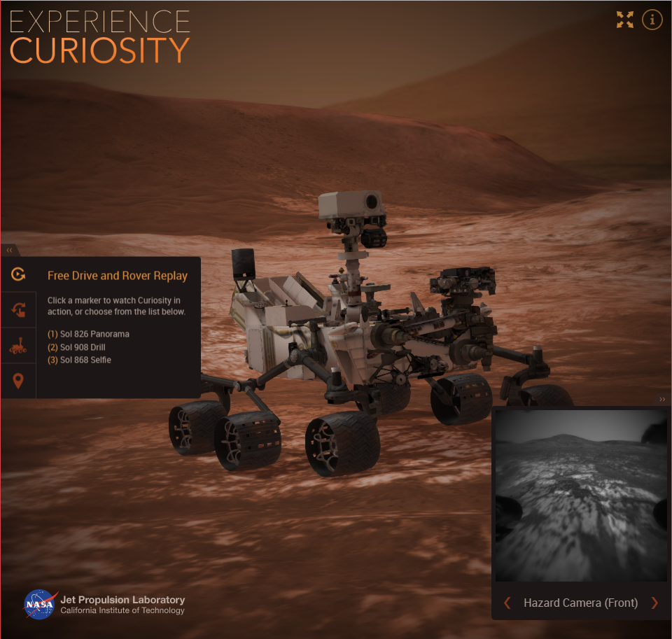

## 2. Creating a WebGL Earth with three.js

*Three.js* is a cross-browser JavaScript library used to create and display animated 3D computer graphics in a web browser. Three.js uses WebGL. The source code is hosted in a repository on [GitHub](https://github.com/mrdoob/three.js). Three.js allows the creation of GPU-accelerated 3D animations using the JavaScript language as part of a website without relying on proprietary browser plugins. This is possible thanks to the advent of WebGL.

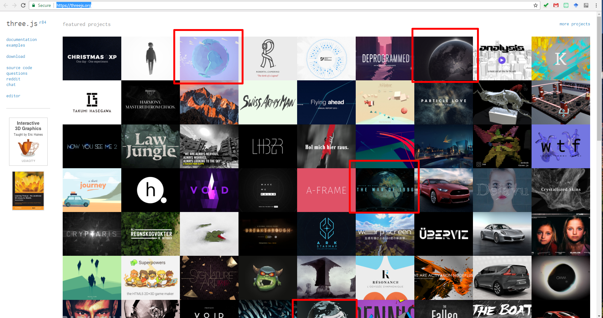

This section shows how to create a WebGL Earth with three.js, a great JavaScript library which helps you to go 3D in the browser. It allows you to create complex 3D scenes with a few lines of JavaScript.

### 2.1 Create a scene


To be able to display something with three.js, you need three things: a scene, a camera and a renderer.

```javascript
var width  = window.innerWidth,
    height = window.innerHeight;

var scene = new THREE.Scene();

var camera = new THREE.PerspectiveCamera(45, width / height, 0.01, 1000);
camera.position.z = 1.5;

var renderer = new THREE.WebGLRenderer();
renderer.setSize(width, height);
```

- The scene is the container used to store and keep track of the objects (earth and stars) we want to render. 

- The camera determines what we'll see when we render the scene. I'm using a PerspectiveCamera, which is what we usually associate with seeing the world. 

- The renderer is responsible to render the scene in the browsers. 

  Three.js supports different renderers like WebGL, Canvas, SVG and CSS 3D. We use window width and height to allow our earth to fill the browser window.

### 2.2 Turn on the light

Next we have to turn on the light:

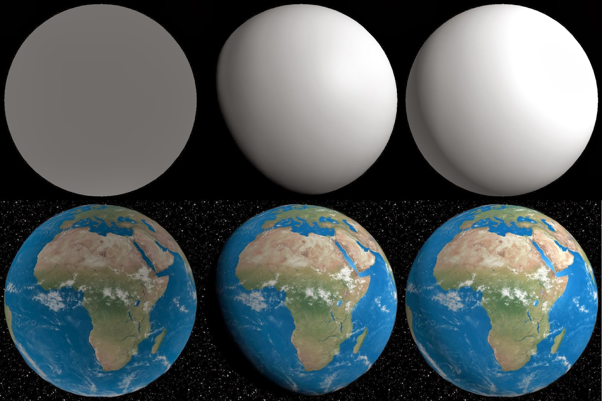

> First: Ambient light - Second: Directional light - Third: Ambient and directional

```javascript
scene.add(new THREE.AmbientLight("#e1d5e4"));

var light = new THREE.DirectionalLight("#444444", 1);
light.position.set(5,3,5);
scene.add(light);
```

Three.js support different light sources that have specific behaviour and uses. I'm using ambient and directional light:

- Ambient light: Basic light which is applied globally.  The dimmed ambient light shows areas away from the sun.
- Directional light: Light that mimics the sun. All the light rays we receive on Earth are parallel to each other.

### 2.3 Shape and texture

Ok, we got the scene, camera, renderer and light sorted. It's time to model our Earth using sphere geometry and material, which is referred to as a mesh in three.js:

```javascript
new THREE.Mesh(
  new THREE.SphereGeometry(0.5, 64, 64),
  new THREE.MeshPhongMaterial({
    map:         THREE.ImageUtils.loadTexture('assets/2_no_clouds.jpg'),
    bumpMap:     THREE.ImageUtils.loadTexture('assets/elevation.jpg'),
    bumpScale:   0.001,
    specularMap: THREE.ImageUtils.loadTexture('assets/water.png'),
    specular:    new THREE.Color("#444444")
  })
);
```

The sphere is created using `THREE.SphereGeometry`. The first parameter is the `radius`, and the second and third parameter is `the number of width and height segments`. The sphere is drawn as a polygon mesh, and by adding more segments it will be less "blocky" - and take more time to render.

> A **polygon mesh** is a collection of vertices, edges and faces that defines the shape of a polyhedral object in 3D computer graphics and solid modeling. The faces usually consist of triangles (triangle mesh), quadrilaterals, or other simple convex polygons, since this simplifies rendering, but may also be composed of more general concave polygons, or polygons with holes.


>  A sphere rendered with 8, 16 and 32 width/height segments.

Next, we use `THREE.MeshPhongMaterial` to wrap map data around the sphere. This material is used to create shiny materials, and we use it to make the ocean reflective.

I'm using map data from [shadedrelief.com](shadedrelief.com). This is a great collection of shaded relief maps by cartographer Tom Patterson. [Natural Earth III](http://www.shadedrelief.com/natural3/) is collection of raster map data tailored towards visualising Earth from space. Compared to photographs of Earth, Natural Earth III offers brighter colours, fewer clouds and distinct environmental zones. The maps are very pleasant to look at.

Let`s start with a texture map of the Earth without clouds:


I reduced the image size to 4096 x 2048 px, which was the maximum texture size for the GPU of my computer. If you want more detailed textures you need to slice up the Earth.

### 2.4 Elevation

Second, I`m using a bump map to enhance the view of the mountains:

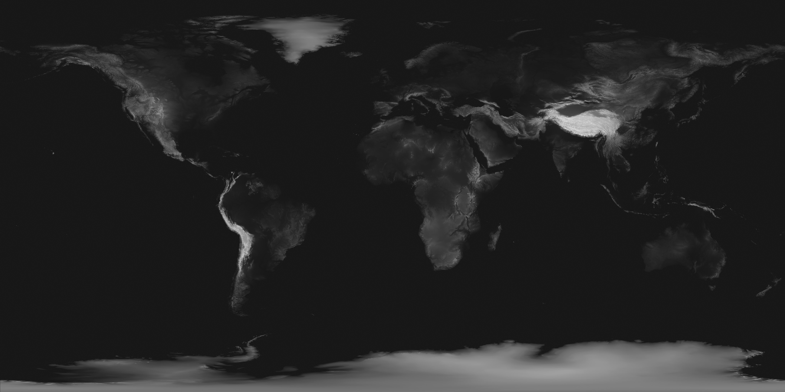

**Bump mapping is a technique to simulate bumps and wrinkles on the surface of an object.** The result is an apparently bumpy surface rather than a smooth surface although the surface of the underlying object is not actually changed. I'm sorry, you can't tilt the camera to see 3D mountains with this technique. You can adjust the bump effect (how much the map affects lighting) with the `bumpScale` parameter.

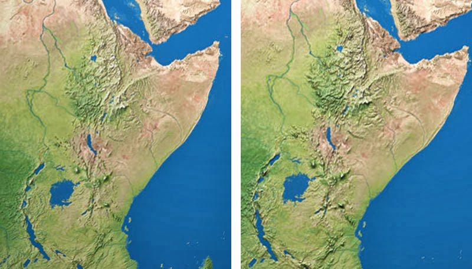

> The original image (left) contains shaded relief, so the bump map effect is limited on this texture (right).

Lastly, I want to make the ocean and lakes reflective by applying a land/water mask. **This specular map** defines the surface's shininess. Only the sea is specular because water reflects water more than earth. You can control the specular color with `specular` parameter.

> **Specular maps** are the maps you use to define a surface's shininess and highlight colour.
>
> The higher the value of a pixel (from black to white), the shinier the surface will appear in-game. Therefore, surfaces such as dry stone or cotton fabric would tend to have a very dark specular map, while surfaces like polished chrome or plastic would tend to have lighter specular maps.
>
> The colour of a pixel is also used, to calculate the resulting colour of the surface. A very saturated specular map will have a very different visual effect than a grey specular map. If you need a more "neutral" highlight on a surface, your specular map should use the inverse of the diffuse map's colour. Using the same colour on the specular as on the diffuse will result in a more saturated highlight when viewed in the game.
>
> You can use contrasts in specular to make a surface appear more visually interesting in the game - for example, this door has a very dark specular for the wood while the metal parts are much lighter, which will make the metal stand out more as a shinier surface when light hits it. This sort of contrast can help make surfaces in the game appear more realistic too.


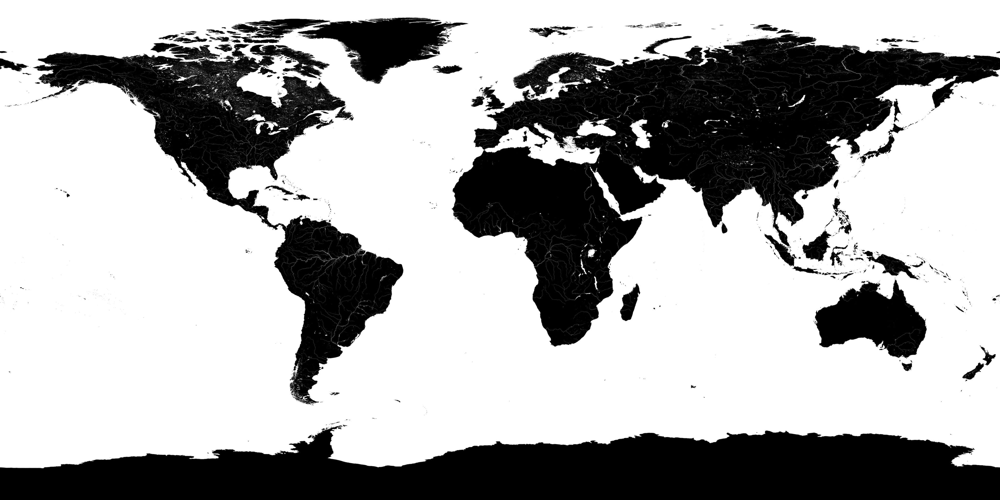

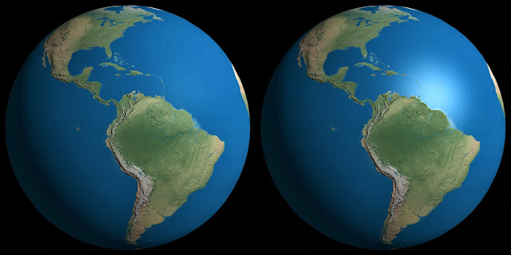

> Adding a specular map to make the ocean reflective (right).

### 2.5 Clouds and stars

Our Earth looks good, but I still miss some clouds. 64 percent of Earth's surface is obscured by clouds on an average day, so this cloud texture received Photoshop edits to remove clouds from land areas.

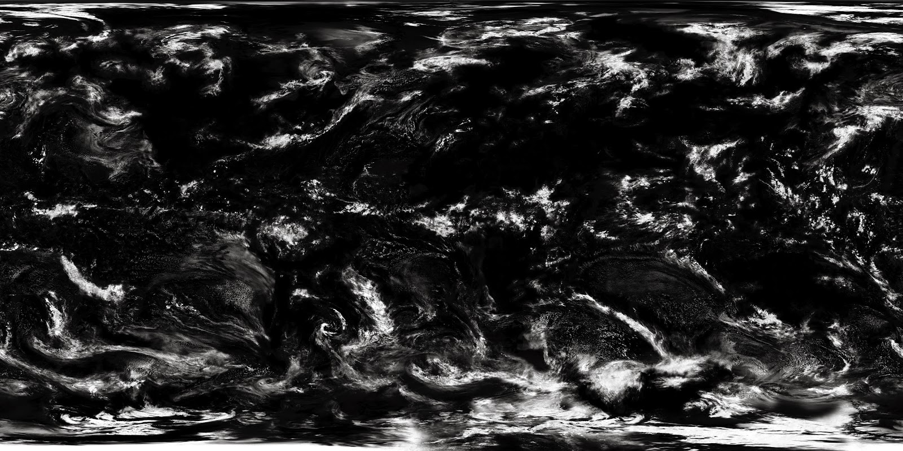

 JPEG cannot be directly used in three.js, so I generate a transparent PNG. I then created a new sphere mesh with a slightly larger radius:

```javascript
new THREE.Mesh(
  new THREE.SphereGeometry(0.503, 64, 64),
  new THREE.MeshPhongMaterial({
    map: THREE.ImageUtils.loadTexture('assets/fair_clouds.png'),
    transparent: true
  })
);
```

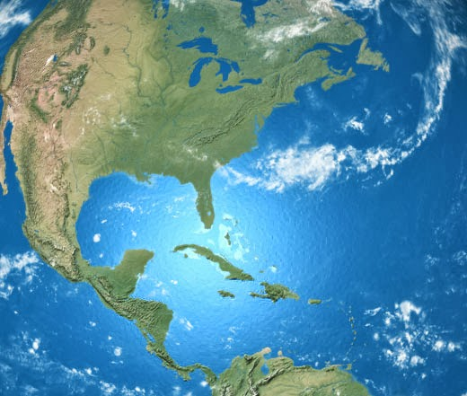

>  Our planet on a very clear day.


The last thing we'll add to our scene is a galaxy starfield:

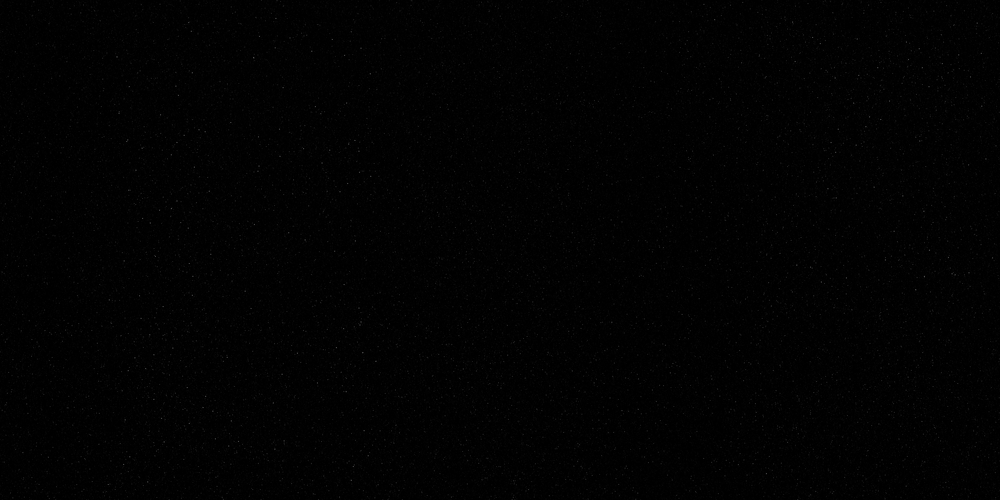

>  Starfield from the ["Learing Three.js" website.](http://learningthreejs.com/blog/2013/09/16/how-to-make-the-earth-in-webgl/)

The starfield is created by adding a large sphere around the Earth and project the star texture on the backside or inside:

```javascript
new THREE.Mesh(
  new THREE.SphereGeometry(90, 64, 64),
  new THREE.MeshBasicMaterial({
    map: THREE.ImageUtils.loadTexture('assets/galaxy_starfield.png'),
    side: THREE.BackSide
  })
);
```

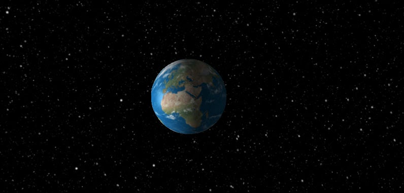

> Earth in space.

As a final touch, let's add some interaction:

```javascript
var controls = new THREE.TrackballControls(camera);

render();

function render() {
  controls.update();
  sphere.rotation.y += 0.0005;
  clouds.rotation.y += 0.0005;
  requestAnimationFrame(render);
  renderer.render(scene, camera);
}
```

### 2.6 Controls

I've added the trackball controls plugin by [Eberhard Graether](http://egraether.com/),  which allows you to rotate, zoom and pan the scene. The render function is called at a specific interval defined by the browser using the `requestAnimationFrame` function. The sphere and clouds are rotating around its axis by increasing the y parameter.

## references:
[1] http://blog.mastermaps.com/2013/09/creating-webgl-earth-with-threejs.html

[2] http://wiki.splashdamage.com/index.php/Specular_Maps

[3] https://en.wikipedia.org/wiki/WebGL

