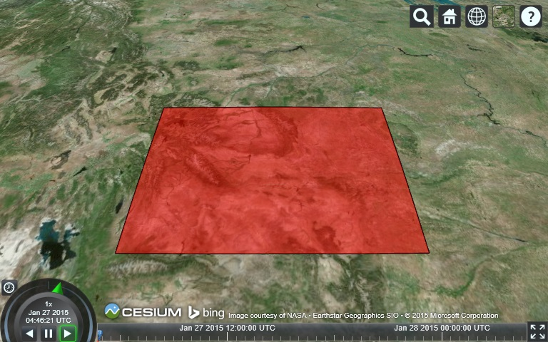
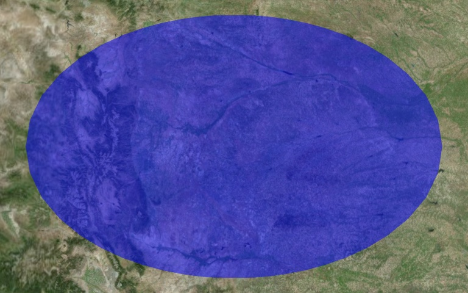
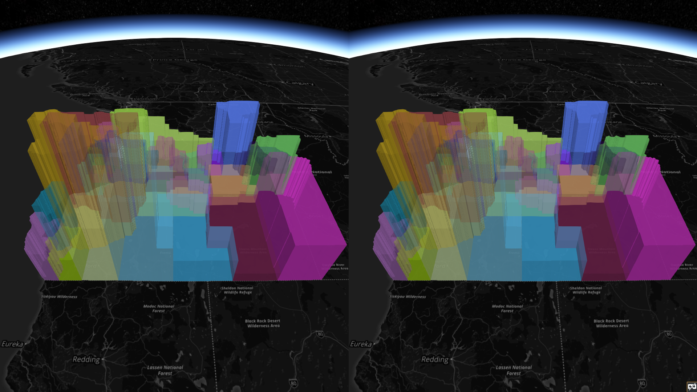

# 3D Web Mapping IV: Thematic Map using a Virtual Globe

> Winter 2017 | Geography 371 | Geovisualization: Web Mapping
>
> Instructor: Bo Zhao | TA: Andy Wilson | Location: 235 Wilkinson | Time: Monday 2-2:50pm

**Learning Objectives**

- visualize spatial data via Entity API;
- add geojson data asynchronously to the virtual globe; and
- make a basic thematic map using the virtual globe.

## 1. Entity API

Cesium has a rich API for spatial data that can be split into two categories: a low-level API geared towards graphics developers, commonly referred to as the Primitive API, and a high-level API for data-driven visualization, referred to as the Entity API.

The Primitive API’s primary goal is to expose the minimal amount of abstraction needed to perform the task at hand. It expects us to think like a graphics programmer and uses graphics terminology. It is structured to provide the most performant and flexible implementation for a given visualization type, not for API consistency. Loading a Model is different from creating a Billboard and both are radically different from creating a Polygon. Each type of visualization is its own distinct feature. Furthermore, they each have different performance characteristics and require different best practices to be followed. While it is powerful and flexible, most applications are better served with a higher level of abstraction than what is offered by the Primitive API.

The goal of the Entity API is to expose a set of consistently designed high-level objects that aggregate related visualization and information into a unified data structure, which we call an Entity. It lets us concentrate on the presentation of our data rather than worrying about the underlying mechanism of visualization. It also provides constructs for easily building complex, time-dynamic visualization in a way that fits naturally alongside static data. While the Entity API actually uses the Primitive API under the hood, that’s an implementation detail we will (almost) never have to concern ourselves with. By applying various heuristics to the data we give it, the Entity API is able to provide flexible, high-performance visualization while exposing a consistent, easy to learn, and easy to use interface.

### 1.1 Our First Entity

One of the best ways to learn the basics of the Entity API is by looking at some code. In order to keep things simple, we’re going to build on the Hello World example in Cesium Sandcastle. If you are set up to develop with Cesium locally, feel free to use your own application instead.

Suppose we wanted to add a polygon for the US state of Wyoming from a list of longitude and latitude degrees. (Wyoming was chosen because it’s such a simple polygon.) We can copy and paste the below code into Sandcastle to do it:

```javascript
var viewer = new Cesium.Viewer('cesiumContainer');

var wyoming = viewer.entities.add({
  name : 'Wyoming',
  polygon : {
    hierarchy : Cesium.Cartesian3.fromDegreesArray([
                              -109.080842,45.002073,
                              -105.91517,45.002073,
                              -104.058488,44.996596,
                              -104.053011,43.002989,
                              -104.053011,41.003906,
                              -105.728954,40.998429,
                              -107.919731,41.003906,
                              -109.04798,40.998429,
                              -111.047063,40.998429,
                              -111.047063,42.000709,
                              -111.047063,44.476286,
                              -111.05254,45.002073]),
    height : 0,
    material : Cesium.Color.RED.withAlpha(0.5),
    outline : true,
    outlineColor : Cesium.Color.BLACK
  }
});

viewer.zoomTo(wyoming);
```

>**Note**:  new Cesium.Cartesian3(x, y, z)
>
>A 3D Cartesian point.
>
>| Name | Type   | Default | Description               |
>| ---- | ------ | ------- | ------------------------- |
>| `x`  | Number | `0.0`   | optional The X component. |
>| `y`  | Number | `0.0`   | optional The Y component. |
>| `z`  | Number | `0.0`   | optional The Z component. |

Run this code on  Sandcastle, it gets us the below image:




We create the `Viewer widget`, which serves as the base for almost all Cesium applications, and then add a new Entity via `viewer.entities.add`. The object we pass to `add` is just an options parameter which provides initial values. The return value is the actual entity instance. Finally, we call `viewer.zoomTo` to make sure the entity is in view.

There are an incredible amount of Entity options available, but for now we specify translucent red for the interior of the `polygon` and a black outline for the border. We also give the entity a display name of “Wyoming”.

### 1.2 Shapes and Volumes

Armed with the basic knowledge of creating a polygon, and thanks to the homogeneous nature of the Entity API, we can now create a variety of graphics by simply using the examples available in Sandcastle as a reference. Here’s a complete list of supported shapes and volumes.

| Boxes                  |  | **entity.box** - [Code example](http://cesiumjs.org/Cesium/Apps/Sandcastle/index.html?src=Box.html) - [Reference documentation](http://cesiumjs.org/Cesium/Build/Documentation/BoxGraphics.html) |
| ---------------------- | ---------------------------------------- | ---------------------------------------- |
| Circles and Ellipses   |  | **entity.ellipse**	- [Code example](http://cesiumjs.org/Cesium/Apps/Sandcastle/index.html?src=Circles%20and%20Ellipses.html)	- [Reference documentation](http://cesiumjs.org/Cesium/Build/Documentation/EllipseGraphics.html) |
| Corridor               |  | **entity.corridor**	- [Code example](http://cesiumjs.org/Cesium/Apps/Sandcastle/index.html?src=Corridor.html)	- [Reference documentation](http://cesiumjs.org/Cesium/Build/Documentation/CorridorGraphics.html) |
| Cylinder and Cones     |  | **entity.cylinder**	- [Code example](http://cesiumjs.org/Cesium/Apps/Sandcastle/index.html?src=Cylinders%20and%20Cones.html)	- [Reference documentation](http://cesiumjs.org/Cesium/Build/Documentation/CyilnderGraphics.html) |
| Polygons               |  | **entity.polygon**	- [Code example](http://cesiumjs.org/Cesium/Apps/Sandcastle/index.html?src=Polygon.html)	- [Reference documentation](http://cesiumjs.org/Cesium/Build/Documentation/PolygonGraphics.html) |
| Polylines              |  | **entity.polyline**	- [Code example](http://cesiumjs.org/Cesium/Apps/Sandcastle/index.html?src=Polyline.html)	- [Reference documentation](http://cesiumjs.org/Cesium/Build/Documentation/PolylineGraphics.html) |
| Polyline Volumes       |  | **entity.polylineVolume**	- [Code example](http://cesiumjs.org/Cesium/Apps/Sandcastle/index.html?src=Polyline%20Volume.html)	- [Reference documentation](http://cesiumjs.org/Cesium/Build/Documentation/PolylineVolume.html) |
| Rectangles             |  | **entity.rectangle**	- [Code example](http://cesiumjs.org/Cesium/Apps/Sandcastle/index.html?src=Rectangle.html)	- [Reference documentation](http://cesiumjs.org/Cesium/Build/Documentation/Rectangle.html) |
| Spheres and Ellipsoids |  | **entity.ellipsoid**	- [Code example](http://cesiumjs.org/Cesium/Apps/Sandcastle/index.html?src=Spheres%20and%20Ellipsoids.html)	- [Reference documentation](http://cesiumjs.org/Cesium/Build/Documentation/EllipsoidGraphics.html) |
| Walls                  |  | **entity.wall**	- [Code example](http://cesiumjs.org/Cesium/Apps/Sandcastle/index.html?src=Wall.html)	- [Reference documentation](http://cesiumjs.org/Cesium/Build/Documentation/WallGraphics.html) |

### 1.3  Materials and Outlines

Regardless of their geometric definition, all shapes and volumes have a common set of properties that control their appearance. The `fill` property is a boolean that specifies if the interior of the surface is filled in, while the `outline`property controls whether the edges of the shape are outlined.

When `fill` is set to `true`, the `material` property determines what that filling looks like. In our next example, let’s create a translucent blue ellipse. By default, `fill` is `true` and `outline` is false, so we only need to specify `material`.

```javascript
var entity = viewer.entities.add({
  position: Cesium.Cartesian3.fromDegrees(-103.0, 40.0),
  ellipse : {
    semiMinorAxis : 250000.0,
    semiMajorAxis : 400000.0,
    material : Cesium.Color.BLUE.withAlpha(0.5)
  }
});
viewer.zoomTo(viewer.entities);
```



## 2. Making a thematic map

In this section, we will make a thematic map to show the number of cell towers in Oregon by county. A county will be visualized by an extruded polygon. The height of an extruded polygon correlates the number of cell towers lying within. The raw cell tower distribution data is in geojson format, and we have used this data set for Practical Exercise 3.  To make such a map, we will (a) use mapbox dark as the base map, (b) add on the geojson data, (c) style and symbolize the map, and (d) add on a  panel of description. The structure of the files in this lecture is:

```powershell
wk09_1_lec23
├─assets
│ ├── counties.geojson
├─css
│ ├── style.css
├─img
└─js
    └─cesium
        ├─Cesium.js
        ├─Widgets
        │  ├── widgets.css
        ├─...
        ├─...
```

After we launch this virtual globe via a web server (e.g., `python SimpleHTTPServer`), we can see the map below:


2.1 Above all, we will create a html page and include the necessary libraries. As shown, within the body `div`, we place two div elements for the virtual globe container and the legend. Also, the customized style sheet locates at `css/style.css`.

```html
<!DOCTYPE html>
<html lang="en">
<head>
    <meta charset="utf-8">
    <meta http-equiv="X-UA-Compatible" content="IE=edge">
    <meta name="viewport" content="width=device-width, initial-scale=1, maximum-scale=1, minimum-scale=1, user-scalable=no">
    <script src="js/cesium/Cesium.js"></script>
    <link rel="stylesheet" href="js/cesium/Widgets/widgets.css">
    <link rel="stylesheet" href="css/style.css">
  	<title> Cell Towers in Oregon by County </title>
</head>
<div id="cesiumContainer"></div>
<div class="legend"></div>
</body>
</html>
```

2.2  Then, we create a `script div` to hold the javascript code. We start with declare the viewer. To make the audience focus the web map, we turn off most of the extra features of a `Cesium.Viewer`. 

```javascript
//create a cesium view, and use the mapbox dark map as the base map.
var viewer = new Cesium.Viewer('cesiumContainer', {
  ...
  vrButton: false,  // virtual reality support
  infoBox: false, // pick a feature and show its attributes
  sceneModePicker: false, // 2d, 2.5d and 3d
  navigationHelpButton: false,
  baseLayerPicker : false,
  fullscreenButton: false,
  geocoder: false,
  homeButton: false,
  animation: false,
  timeline: false
});
```

To stand out the thematic map on a virtual globe, we change the imagery Provider to `mapbox.dark`.

```javascript
var viewer = new Cesium.Viewer('cesiumContainer', {
  imageryProvider : new Cesium.MapboxImageryProvider({
    mapId : 'mapbox.dark',
    accessToken : 'pk.eyJ1IjoiamFrb2J6aGFvIiwiYSI6ImNpenh0dG41ZjAyY3gzMXFsdTJqbm5oNmwifQ.ucAGT19EfvxX2EUaHUwAxA'
  }),
   ...
});
```

2.3  Then we will load the geojson data and add it to the viewer object. After the data is added, we need to move the viewer by the `zoomTo` function.

```javascript
var dataSource = Cesium.GeoJsonDataSource.load('assets/counties.geojson').then(
  function(dataSource) {
    viewer.dataSources.add(dataSource);
    viewer.zoomTo(dataSource);
  }
);
```

In order to differentiate the counties, we assign a random color to each county, and the height of the extruded polygon of each county correlates with the number of cell towers lying within.

```javascript
var p = dataSource.entities.values;
for (var i = 0; i < p.length; i++) {

  p[i].polygon.material = Cesium.Color.fromRandom({
    alpha : 0.7
  });
  p[i].polygon.outline = false;

  p[i].polygon.extrudedHeight = 10000 * p[i].properties.CT_CNT;
}
```

2.4 Now, we have already made the thematic map, in order to help users to read this map, we will add a legend, the process of adding a legend has been introduced in the map client series and the practical exercise 3. In general, we will put the content in a `div` and then capture the div using the class name, and style it by css stylesheet.  Here, the class of the `legend div` is  `legend`, as shown below.

```html
<div class="legend">
    <h4> Cell Towers in Oregon by County  </h4>
    <i style="background: #b30000"></i> <p><b> a county in Oregon </b></p><br/>
    <p> A county is represented by an extruded polygon with a random color. The height of an extruded polygon correlates with the number of cell towers lying within. </p><br/>
    <p> Author: <a href="http://ceoas.oregonstate.edu/profile/zhao/">Bo Zhao</a> | Virtual globe Lib: cesium.js | BaseMap: Mapbox </p>
</div>
```

And the stylesheet.

```css
.legend {
    line-height: 16px;
    width: 270px;
    position: absolute;
    z-index: 1000;
    left: 10px;
    bottom: 10px;
    color: #a0a0a0;
    font-family: 'Open Sans', Helvetica, sans-serif;
    padding: 6px 8px;
    background: #000000;
    background: rgba(38, 38, 38, 0.5);
    box-shadow: 0 0 15px rgba(0,0,0,0.2);
    border-radius: 5px;
}

.legend i {
    width: 16px;
    height: 16px;
    float: left;
    margin-right: 8px;
    opacity: 0.7;
}

.legend p {
    font-size: 12px;
    line-height: 16px;
    margin: 0;
}
```

Now we have made the thematic map on a virtual globe. Someone may find the default cesium.js credits distractive,  we can actually turn the credits off by the following code. 

```javascript
document.getElementsByClassName("cesium-widget-credits")[0].style.visibility = "hidden";
```

Notably, if we turn the default credit off, we should credit cesium's contribution elsewhere on the interface.


## Concluding remarks

Play the virtual globe by modifying the code, for example, changing the material, stroke, and extruded height. In addition, try to access a piece of geojson from a remote server (e.g., www.mapio.us). The `GeoJsonDataSource.load` function allows us to load data from both local and remote server. 

What's more, you may be also interested in activating some useful features, such as turning on the VR function or changing into another browsing perspective.



> virtual realty function


> Columbus View

## References:

[1].  https://cesiumjs.org/tutorials/Visualizing-Spatial-Data/