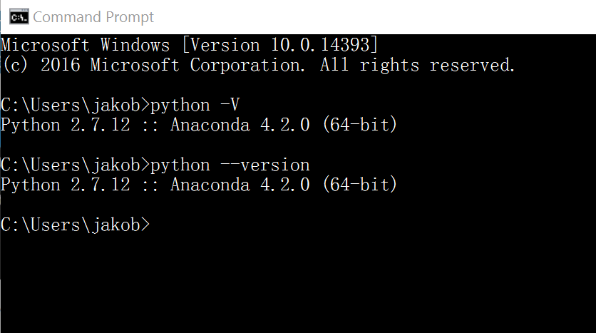
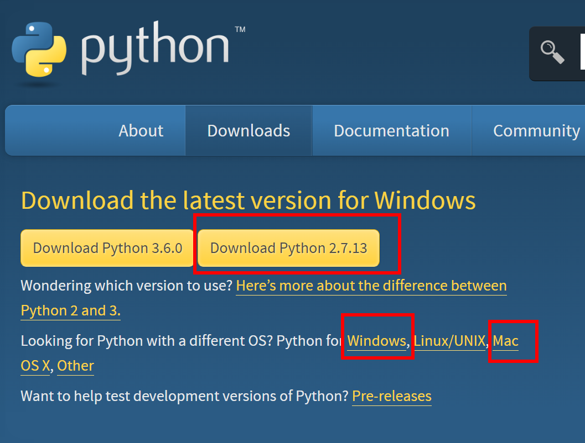
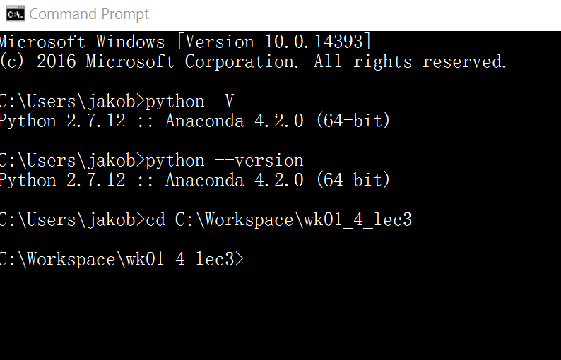

# A tutorial on creating a web server with SimpleHTTPServer

SimpleHTTPServer is a python module which allows you to instantly create a web server or serve your files in a snap. Main advantage of python’s SimpleHTTPServer is you don’t need to install anything since you have python interpreter installed. You don’t have to worry about python interpreter because almost all Linux distributions, python interpreter come handy by default.

You also can use SimpleHTTPServer as a file sharing method. You just have to enable the module within the location of your shareable files are located. I will show you several demonstrations in this article by using various options.

## 1.  Check for Python Installation

- Check whether python is installed in your server or not, by issuing below command in cmd.exe (windows) or Terminal (Mac).

```bash
$ python -v
or
$ python --version
```



> **Note:** `$` indicates where a line of code starts.

It will show you the version of the python interpreter you’ve got and it will give you an error message if it is not installed.

- You’re lucky if it was there by default. Less work actually. If it was not installed by any chance, install it by downloading python from https://www.python.org/downloads/.  For this lecture, please install Python 2.x.y. (x and y indicate a release number, make sure it is 2 rather than 3). Make sure you download the right python version matching your OS system (Windows or Mac).



## 2. Create a Test Directory and Enable SimpleHTTPServer

- Create a test directory where you don’t mess with system files. For example, we can create a server under our workspace at `C:/workspace`. In this workspace, we created a directory called `wk01_4_lec3` and also I have added some test files for testing (the test files could be those files unzipped from the lecture package).



- Your prerequisites are ready now. All you have to do is try python’s `SimpleHTTPServer` module by issuing below command within your test directory (IC:/workspace/wk01_4_lec3`).


- After enabling `SimpleHTTPServer` successfully, it will start serving files through port number `8000`. You just have to open up a web browser and enter `localhost:8000`).


- SimpleHTTPServer serves your files successfully. You can see what has happened at the terminal, after you accessed your server through web browser by having a look at where you executed your command.


> **Note:** 
> By default python’s SimpleHTTPServer serves files and directories through port `8000`, but you can define a different port number (Here I am using port `80`) as you desire with the python command as shown below.
>
> If there’s a `index.html` file located in your serving location, python interpreter will automatically detect it and serve the html file instead of serving your files.
>
> If you want to stop serving, you will have to stop the running module by pressing `ctrl+c`. 

SimpleHTTPServer is a very handy function supported by python. You can serve your files or your own html code in a snap. Best thing is you won’t have to worry about installing anything at all. In a scenario like you want to share a file with someone, you don’t have to copy the file to a shared location or a cloud drive.

## Reference:

[1] Uvindasiri 2015 How to Use Python ‘SimpleHTTPServer’ to Create Webserver or Serve Files Instantly retrieved on Jan 14, 2017 from http://www.tecmint.com/python-simplehttpserver-to-create-webserver-or-serve-files-instantly/

[2] Python SimpleHTTPServer — Simple HTTP request handler retrieved on Jan 14, 2017 from https://docs.python.org/2/library/simplehttpserver.html

